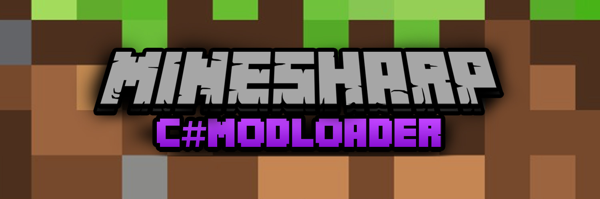

# MSharp ModLoader: Modding C# para Minecraft



## ¿Qué es M#?

**MSharp ModLoader** es un framework que permite crear mods para Minecraft (1.8.9 Forge, por ahora) usando **C#** y herramientas modernas como Visual Studio, integrando la lógica de los mods con el juego en tiempo real a través de un puente entre **Java** y **C#**.  
El objetivo es **democratizar el modding, hacerlo más accesible y moderno**.

---

## Características principales

- **Mods en C#**: Escribe mods usando C# y Visual Studio, sin depender de Java.
- **Comunicación en tiempo real**: Sincronización bidireccional entre Minecraft (Java) y mods en C# usando Named Pipes.
- **Carga dinámica de mods**: Los mods se cargan **como archivos .m#** y pueden reaccionar a eventos del juego.
- **Arquitectura extensible**: Pensado para integrar herramientas visuales como Unity en el futuro.
- **Ejemplo de mod**: Incluye un mod de ejemplo para empezar rápido.

---

## Arquitectura

```
+-------------------+         Named Pipe         +-------------------+
|   Minecraft (Java)| <-----------------------> |    C# Launcher    |
|  + Forge Mod      |                           | + ModLoader       |
|  | MSharpBridge   |                           | + Mods (IMsharpMod)|
+-------------------+                           +-------------------+
```

- **Java Side:** Mod Forge (`MSharpBridgeMod`) que actúa como cliente de la pipe.
- **C# Side:** Launcher que carga mods, gestiona la pipe y despacha eventos.
- **Comunicación:** Named Pipes para mensajes en tiempo real.

---

## ¿Cómo funciona?

1. **Lanzador en C#**: Inicia Minecraft y el servidor de Named Pipe.
2. **Carga de mods**: Busca y carga DLLs de mods escritos en C#.
3. **Mod puente en Java**: Se conecta al pipe y envía/recibe mensajes con el launcher.
4. **Eventos y lógica**: Los mods en C# reaccionan a eventos del juego y pueden enviar comandos de vuelta a Minecraft.

---

## ¿Por qué es especial?

- Permite usar herramientas modernas (C#, Visual Studio, Unity) para modding.
- Facilita la interoperabilidad entre dos lenguajes y ecosistemas distintos.
- Abre la puerta a la edición de assets y lógica en tiempo real.
- Ideal para educación, innovación y para quienes quieren devolverle algo a Minecraft.

---

## Instalación y uso rápido

1. **Clona el repositorio**  

   ```bash
   git clone https://github.com/tuusuario/MSharpBridge.git
   ```

2. **Compila los proyectos C#**  
   Abre la solución en Visual Studio y compila.

3. **Configura el mod de Forge**  
   - Ve a `MSharpForgeBridgeMod` y sigue las instrucciones del README para compilar el mod Java.
   - Copia el `.jar` generado a la carpeta `mods` de tu instalación de Minecraft Forge 1.8.9.

4. **Agrega tus mods en C#**  
   - Crea un proyecto de biblioteca que implemente la interfaz `IMsharpMod`.
   - Coloca el `.M#` en la carpeta `Mods#\Mods`.

5. **Ejecuta el launcher**  
   - Corre el launcher C# (`MSharp.Launcher.CLI`) para iniciar Minecraft y el puente.

---

## Ejemplo de mod en C#

```csharp
public class ModVioleta : IMsharpMod
{
    public void OnStart() => Console.WriteLine("🟪 Mod Violeta iniciado.");
    public void OnEvent(string type, object? payload = null)
    {
        Console.WriteLine($"📨 Evento recibido desde Java: {type} | Payload: {payload}");
    }
    public void OnTick() { }
}
```

---

## Créditos y agradecimientos

- Inspirado por la comunidad de Minecraft y el deseo de devolverle algo al juego.
- Basado en Forge y tecnologías libres.
- Iván E. Rodriguez - Autor principal

---

## Licencia

Este proyecto se distribuye bajo la licencia LGPL v2.1 o posterior (ver archivos LICENSE).

---

## Imagen de portada

La imagen de portada se encuentra en `Assets/PORTADA.jpg`.  
Puedes cambiarla por la que prefieras para personalizar tu README.

---

¡Gracias por ser parte de esta nueva era del modding en Minecraft!
